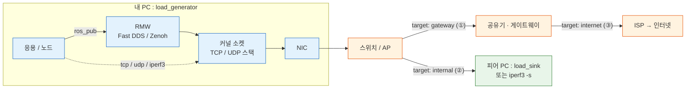
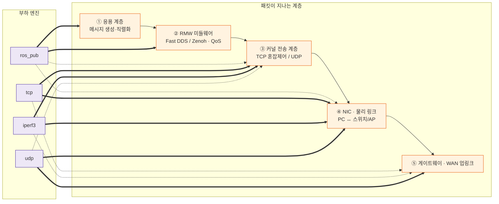
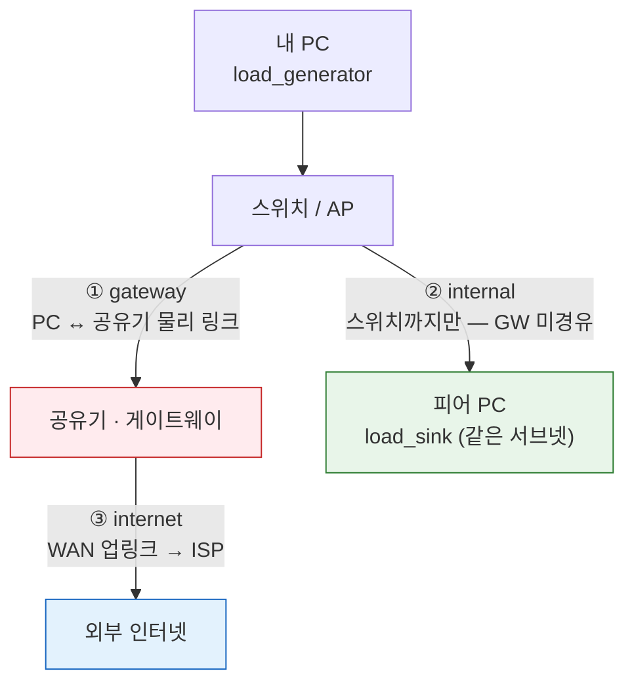
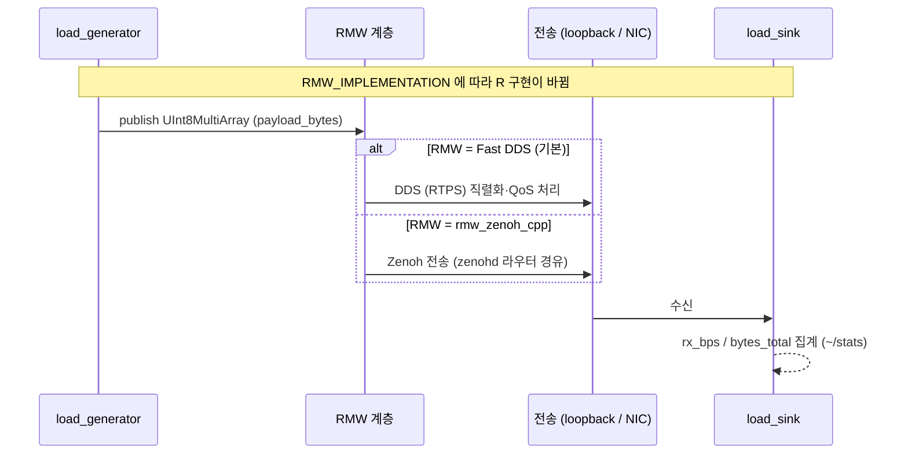
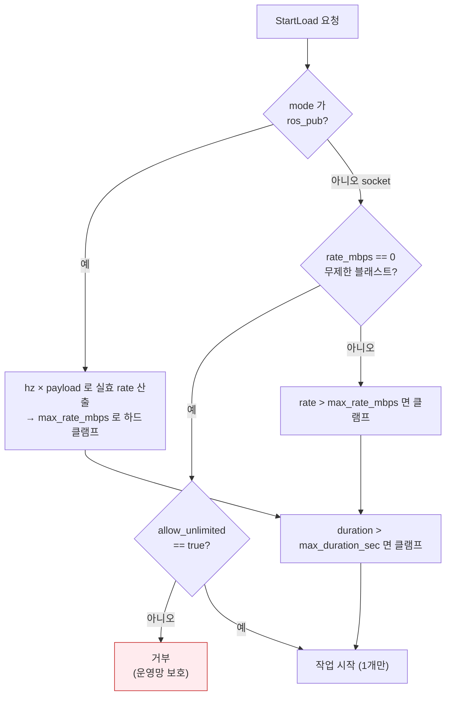

# 부하 테스트 가이드 — 각 부하 방법과 작용 지점

`load_generator` / `load_sink` 노드가 발생시키는 **부하 방법(엔진)** 과, 각 부하가
**시스템의 어느 계층·구간에 작용**하는지를 정리한 문서입니다. 사용법은
[README](../README.md#load_generator--load_sink-노드-부하-발생--수신)를 참조하십시오.

---

## 1. 한눈에 보기 — 엔진 × 작용 지점

| 엔진(`mode`) | 발생시키는 부하 | 주로 작용하는 지점 | 수신 측 필요 | 적합 범위 |
|---|---|---|---|---|
| `ros_pub` | 대용량 ROS 메시지 고속 발행 | **응용 직렬화 + RMW(DDS/Zenoh) + QoS + 전송 계층** | `load_sink`(ROS 구독) | ROS2 / Zenoh 미들웨어 |
| `tcp` | TCP 스트림 연속 전송 | **커널 TCP 스택(혼잡제어/ACK) + NIC + 링크** | `load_sink` 또는 `iperf3 -s` | ② 내부 LAN |
| `udp` | UDP 데이터그램 발사 | **NIC egress + 물리 링크 + 게이트웨이/업링크** | (불필요) | ① 게이트웨이 링크, ③ WAN |
| `iperf3` | iperf3 클라이언트 래핑 | **커널 소켓 + NIC + 링크 (정밀 측정)** | `iperf3 -s` | 정밀 측정 |

> 핵심: `ros_pub`은 **위쪽(미들웨어) 계층**을, `udp`는 **아래쪽(물리 링크) 계층**을,
> `tcp`/`iperf3`는 **그 사이(커널 전송 계층)** 를 집중적으로 부하합니다.

---

## 2. 전체 토폴로지 — 어디로 트래픽이 흐르는가



- **`target` 키워드**가 트래픽의 목적지(=부하받는 구간)를 결정합니다.
- 같은 서브넷의 `internal` 트래픽은 **스위치에서 바로 전달**되어 게이트웨이를 거치지 않습니다.
- `gateway`/`internet` 트래픽만 **PC↔공유기 물리 링크**를 실제로 통과합니다.

---

## 3. 계층별 작용 지점 — 어떤 부하가 어디를 누르는가

패킷이 통과하는 계층을 아래→위로 쌓고, 각 엔진이 **집중적으로 부하하는 계층**을 화살표로
연결했습니다. (실선 = 주 작용, 점선 = 부수적 통과)



| 계층 | 무엇이 한계가 되나 | 이 계층을 누르는 엔진 |
|---|---|---|
| ① 응용/직렬화 | CPU·메모리, 메시지 생성 비용 | `ros_pub` |
| ② RMW 미들웨어 | DDS/Zenoh 처리량, QoS(RELIABLE 재전송), 디스커버리 | `ros_pub` |
| ③ 커널 전송 | TCP 혼잡제어·ACK, 소켓 버퍼 | `tcp`, `iperf3` |
| ④ NIC·물리 링크 | NIC 대역폭, 케이블/Wi-Fi 링크 속도 | `udp`, `tcp`, `iperf3` |
| ⑤ 게이트웨이·WAN | 공유기 처리 능력, ISP 업링크 대역폭 | `udp`(목적지 gateway/internet) |

> **왜 `ros_pub`이 미들웨어 테스트인가**: rclpy → RMW → DDS/Zenoh 경로를 그대로 타기 때문에,
> `RMW_IMPLEMENTATION`만 바꾸면 **동일 노드로 Fast DDS와 Zenoh를 비교**할 수 있습니다.
> 같은 호스트면 공유메모리/loopback, 다른 호스트면 NIC를 거치므로 ④까지 부하가 내려갑니다.
>
> **왜 `udp`가 링크/게이트웨이 포화에 적합한가**: UDP는 혼잡제어가 없고 리스너가 없어도
> 패킷이 라우팅 경로를 따라 흐르다 폐기되므로, **수신 서버 없이도 ④⑤ 구간을 실측 포화**시킬 수 있습니다.

---

## 4. 범위(`target`)별 패킷 경로

`target` 키워드가 패킷이 통과하는 구간을 결정합니다. 같은 서브넷 통신은 게이트웨이를
거치지 않는다는 점이 ①·②·③을 가르는 핵심입니다.



| 범위 | `target` | 통과 구간 | 권장 엔진 | 측정 의도 |
|---|---|---|---|---|
| ① 게이트웨이 링크 | `gateway` | PC ↔ 스위치 ↔ 공유기 | `udp`(리스너 불필요) / `iperf3`(라우터에 서버 시) | PC↔공유기 물리 링크·공유기 처리 능력 |
| ② 내부 LAN | `internal` | PC ↔ 스위치 ↔ 피어 | `tcp`(load_sink) / `iperf3 -s` | LAN/스위치 처리량 (GW 미경유) |
| ③ 외부 인터넷 | `internet` | PC ↔ 공유기 ↔ ISP ↔ 인터넷 | `udp` / `iperf3`(공용 서버) | WAN 업링크·ISP 대역폭 |

---

## 5. ros_pub 작업의 미들웨어 경로 (DDS vs Zenoh)

`ros_pub`은 동일 노드 코드가 RMW에 따라 다른 미들웨어를 부하합니다.



Zenoh 실행:

```bash
ros2 run rmw_zenoh_cpp rmw_zenohd        # 별도 터미널, Zenoh 라우터
export RMW_IMPLEMENTATION=rmw_zenoh_cpp   # generator/sink 양쪽 동일하게
ros2 launch generate_orbbec_launch load_sink.launch.py
ros2 launch generate_orbbec_launch load_generator.launch.py
```

---

## 6. 안전장치 — 부하가 무한정 커지지 않도록



- `max_duration_sec`(기본 300s), `max_rate_mbps`(기본 1000Mbps)로 상한.
- 무제한 블래스트(`rate_mbps: 0`)는 `allow_unlimited: true` 명시가 있어야만 허용.
- `ros_pub`은 타이머로 유한하지만 실효 rate도 동일 상한으로 클램프.
- 한 번에 **1개 작업만** 실행(실행 중 재요청은 거부, `~/stop` 후 재시작).

> ⚠️ 본인이 관리 권한을 가진 네트워크에서만, 가급적 점검 시간대에 사용하십시오.
